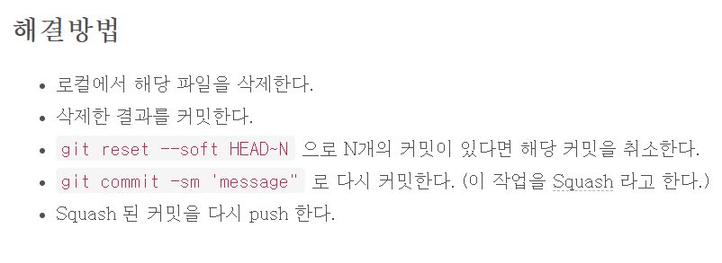

# git intro

0. git cmd 기본 사용 법

   `$ mkdir 폴더명` 폴더 생성하기

   `$ cd ` 경로 이동 	

   `$ ls` 폴더 내 목록 보기 `$ ls -a` 숨겨진 것 까지 모두 보기

   `./` : 현재폴더 `../` : 상위 폴더

   `$ touch 파일명` 새 파일 생성 `$ touch .파일명` 숨김파일 생성됨

   `$ rm 파일명` 파일 삭제 `$ rm *.txt`  모든 txt파일 삭제  `$ rm -r` 폴더 지우기

   `$ pwd` 현재경로 표시

   `$ rm -rf .git` master로 잘못 만들었을 때 지우기

## local git

1. git 다운로드 및 설치 

2. 초기화 `$ git init`
   1. 실제로는 `.git/` 폴더가 생성됨
   2. 버전관리가 시작 됨
   3. repo(repository)라고 부름
   
3. 서명 설정
   1. `$ git config --global user.name 'name'`
   2. `$ git config --global user.email 'email@mail'`
   
   *참고* : `$ git config --global credential.helper store` 사용자이름과 비밀번호를 매번 입력하지 않아도 되게함 \\\ `git config --global credential.helper cache <timeout>` : 일정시간동안 

   # github계정에 등록되어 있는 email을 사용해야됨
   
4. 리포의 상태 보기(stage의 상태) `$ git status`

5. stage에 올리기 `$ git add`
   stage add 취소하기 filename 안쓰면 전체 취소 `$git reset HEAD filename`

   - 특정파일만 올리기 `$ git add 파일명1 파일명2` ㅊㅇ 

   - 내 위치 폴더 내 수정된 것 다올리기 `$ git add .`

6. snapshot 찍기 `$ git commit`
   commit 취소하기 

   ```
   [방법 1] commit을 취소하고 해당 파일들은 staged 상태로 워킹 디렉터리에 보존
   $ git reset --soft HEAD^
   [방법 2] commit을 취소하고 해당 파일들은 unstaged 상태로 워킹 디렉터리에 보존
   $ git reset --mixed HEAD^ // 기본 옵션
   $ git reset HEAD^ // 위와 동일
   $ git reset HEAD~2 // 마지막 2개의 commit을 취소
   [방법 3] commit을 취소하고 해당 파일들은 unstaged 상태로 워킹 디렉터리에서 삭제
   $ git reset --hard HEAD^
   ```

    ```

    ```
   
7. 로그 보기 `$ git log`

8. 상태 보기 `$ git status`

9. git diff : 변경된부분 나타냄

10. git reset : 수정하기 전으로 되돌아가기

### 집 컴퓨터 세팅

1. git 다운 및 설치
2. `$ git config --global ....` 
3. 원하는 위치에서 `$ git init`
4. `$ git clone <URL>` : 
5. `$ git remote -v`로 경로 알 수 있음, github에서 Clone with https


working directory

처음 확인한 파일들 -> untracked 상태

add 하면 stage로 올린다(tracking 시작)

commit 하면 stage전체를 history로 기록, stage에서 사라짐

파일 수정 일어남

add 하면 stage로 올린다(바뀐 부분만 올라감)

commit 하면 history로 기록(바뀐부분 기록)

삭제할떄도 add commit작업 수행해야 한다.

## github

1. 원격 저장소(remote repository) 생성

2. local repo => remote repo  연결 `$ git remote add origin <URL>`

3. local commit 들을 remote로 보내기 `$ git push origin master`

4. `$ git push` == `$ git push origin master`로 단축 명령하기

   `$ git push -u origin master`

5. 다른 컴퓨터에서 remote repo 받아오기(**최초 1회**)

   `$ git clone <URL>`

6. 이후 remote repo 변경사항을 local repo에서 반영하기

   `$ git pull`


## TIL 관리 시나리오

1. 멀캠에 온다.
2. `$ git pull`
3. 열공
4. `$ git add` & `$git commit` 으로  중간중간 저장
5. 퇴근 전 `$ git push`
6. 집에서 켜서 동기화를 위해 ` $ git pull`
7. 수정 후 `$ git add와 commit`, `$ git push`

### 

## branch, pull request

각자 컴퓨터에서 

원하는 폴더 들어감

git clone 해당 repo url~~

git pull

`$ git checkout -b changyoon/add_cookie_in_head` branch 생성

	- 실제 폴더 들어가보면 branch 상태와 master 상태일때 각각의 상태에 맞게 폴더내용이 보인다

확인 `$ git branch`

`$ git add 해당파일`

`$ git commit -m '~~'`

`$ git push`하면 git push~~ 라고 뭐라 뜨는데 복사 해서 씀

github에 master ~~ 에 보면 모든 branch 뜸

compare&pull request 누르면 메시지 남길수 있음 밑으로 내리면 file change 내역 확인가능

create pull request

pull request 탭에 들어가면 mater가 코드 점검(file changed 탭에서 확인) 한다. +눌러서 잘못된게 있으면 요청사항 남길 수 있음


local에 가져와서 변경사항 코드 돌려볼수 있는데 잘안함

​	- git fetch

​	- git checkout  -b 해당 사람/add_cookie_in_head


확인이 다끝나면

conversation 탭에 Merge pull requeset -> confrim merge

master탭 가보면 수정사항 적용되어있음(같은 코드 여러사람이 작업하면 complete해결해줘야됨??)


git reset 으로 이전 commit  지점으로 돌아갈수 있음

(soft, hard 등 옵션 설정 가능)


# 용량큰거 잘못 올렸을 때 해결방법



