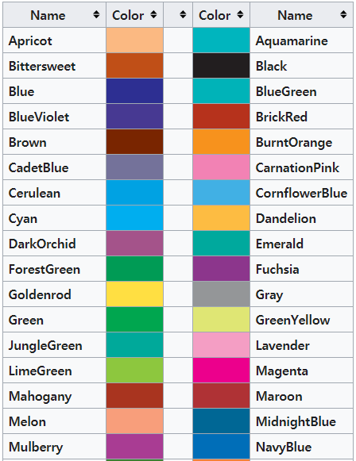
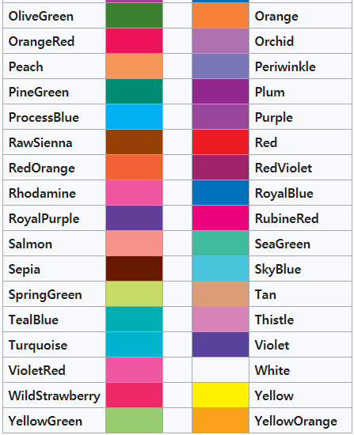

| Symbol      | Script                        |
| ----------- | ----------------------------- |
| $\alpha$    | \alpha                        |
| $A$         | A                             |
| $\beta$     | \beta                         |
| $B$         | B                             |
| Γ, *γ*      | \Gamma,\gamma                 |
| Δ, *δ*      | \Delta,\delta                 |
| *ϵ*, *ε*    | \epsilon,\varepsilon          |
| *ζ*         | \zeta                         |
| *η*         | \eta                          |
| *ι*         | \iota                         |
| *κ*, ϰ      | \kappa,\varkappa              |
| Λ, *λ*      | \Lambda,\lambda               |
| Θ, *θ*, *ϑ* | \Theta,\theta,\vartheta\theta |
| *ν*         | \nu                           |
| Ξ, *ξ*      | \Xi,\xi                       |
| *ο*         | \omicron                      |
| Π, *π*, *ϖ* | \Pi,\pi,\varpi                |
| *ρ*, *ϱ*    | \rho,\varrho                  |
| Σ, *σ*, *ς* | \Sigma,\sigma,\varsigma       |
| *τ*         | \tau                          |
| Υ, *υ*      | \Upsilon,\upsilon             |
| Φ, *ϕ*, *φ* | \Phi,\phi,\varphi             |
| *χ*         | \chi                          |
| Ψ, *ψ*      | \Psi,\psi                     |
| Ω, *ω*      | \Omega,\omega                 |

### Operators

| Symbol    | Script                |
| --------- | --------------------- |
| $\cos$    | \cos                  |
| $\sin$    | \sin                  |
| $\lim$    | \lim                  |
| $\exp$    | \exp                  |
| $\to$     | \to                   |
| $\infty$  | \infty                |
| $\equiv$  | \equiv                |
| $\bmod$   | \bmod                 |
| $\times$  | \times                |
| $\cdot$   | \cdot                 |
| \| ∥      | \| \|                 |
| { }       | \{ \}                 |
| / ∖       | / \backslash          |
| $$        | \langle \rangle       |
| ↑ ⇑       | \uparrow \Uparrow     |
| ↓ ⇓       | \downarrow \Downarrow |
| ⌈ ⌉       | \lceil \rceil         |
| ⌊ ⌋       | \lfloor \rfloor       |
| $\subset$ |                       |

### Set and logic notation

| Symbol                                            | Script                                 |
| ------------------------------------------------- | -------------------------------------- |
| ∃ ∄                                               | \exists \nexists                       |
| ∀                                                 | \forall                                |
| ¬                                                 | \neg                                   |
| ⊂ ⊃                                               | \subset \supset                        |
| ∈ ∉ ∋                                             | \in \notin \ni                         |
| ∧ ∨                                               | \land \lor                             |
| → ←                                               | \rightarrow or \to \leftarrow or \gets |
| ↦                                                 | \mapsto                                |
| ⟹ ⇒                                               | \implies \Rightarrow                   |
| ↔ ⇔ ⟺                                             | \leftrightarrow \Leftrightarrow \iff   |
| ⊤ ⊥                                               | \top \bot                              |
| ∅ ∅                                               | \emptyset \varnothing                  |
| $\ge$                                             | \ge                                    |
| $\le$                                             | \le                                    |
| $\therefore$   $\because$                         | \therefore, \because                   |
| $\fallingdotseq$                                  | \fallingdotseq                         |
| $\precapprox$                                     | \precapprox                            |
| $\between$                                        | \between                               |
|                                                   |                                        |
| $\gtrdot$,$\geqslant$,$\geqq$,$\leqq$,$\leqslant$ |                                        |

### Power and Indices

| Symbol    | Script  |
| :-------- | :------ |
| $k_{n+1}$ | k_{n+1} |
| $n^2$     | n^2     |
| $k_n^2$   | k_n^2   |

### Fractions and Binomials

| Symbol                      | Script                    |
| :-------------------------- | :------------------------ |
| $\frac{n!}{k!(n-k)!}$       | \frac{n!}{k!(n-k)!}       |
| $\binom{n}{k}$              | \binom{n}{k}              |
| $\frac{\frac{x}{1}}{x - y}$ | \frac{\frac{x}{1}}{x - y} |
| $^3/_7$                     | ^3/_7                     |

### Roots

| Symbol        | Script      |
| :------------ | :---------- |
| $\sqrt{k}$    | \sqrt{k}    |
| $\sqrt[n]{k}$ | \sqrt[n]{k} |

### Sums and Integrals

| Symbol                                      | Script                                    |
| ------------------------------------------- | ----------------------------------------- |
| $\sum_{i=1}^{10} t_i$                       | \sum_{i=1}^{10} t_i                       |
| $\int_0^\infty \mathrm{e}^{-x},\mathrm{d}x$ | \int_0^\infty \mathrm{e}^{-x},\mathrm{d}x |
| $\int\limits_{0}^{\infty} e^{-x} dx$        | \int\limits_{0}^{\infty} e^{-x} dx        |
| $\sum$                                      | \sum                                      |
| $\sum\limits_{i=1}^{100} x$                 | \sum\limits_{i=1}^{100} x                 |
| $\prod$                                     | \prod                                     |
| $\coprod$                                   | \coprod                                   |
| $\bigoplus$                                 | \bigoplus                                 |
| $\bigotimes$                                | \bigotimes                                |
| $\bigodot$                                  | \bigodot                                  |
| $\bigcup$                                   | \bigcup                                   |
| $\bigcap$                                   | \bigcap                                   |
| $\biguplus$                                 | \biguplus                                 |
| $\bigsqcup$                                 | \bigsqcup                                 |
| $\bigvee$                                   | \bigvee                                   |
| $\bigwedge$                                 | \bigwedge                                 |
| $\int$                                      | \int                                      |
| $\oint$                                     | \oint                                     |
| $\iint$                                     | \iint                                     |
| $\iiint$                                    | \iiint                                    |
| $\idotsint$                                 | \idotsint                                 |
| $\sum_{\substack{0<i<m}{0<j<n}} P(i, j)$    | \sum_{\substack{0<i<m\0<j<n}} P(i, j)     |
| $\int\limits_a^b$                           | <br /\int\limits_a^b                      |
| $\forall$                                   | \forall                                   |
| $\large A \Large A \LARGE A$                | \large A \Large A \LARGE A                |
| $\textrm{abc}\textsf{abc}\texttt{abc}$      | 글씨체                                    |
| $\textit{abc}\underline{abc}\textbf{abc}$   |                                           |
|                                             | \textmd{abc}                              |
| $\part{dddd}$                               |                                           |

| Symbol                | Script              |
| :-------------------- | :------------------ |
| $a’$ $a^{\prime}$     | a` a^{\prime}       |
| $a’’$                 | a’’                 |
| $\hat{a}$             | hat{a}              |
| $\bar{a}$             | \bar{a}             |
| $\grave{a}$           | \grave{a}           |
| $\acute{a}$           | \acute{a}           |
| $\dot{a}              | \dot{a}             |
| $\ddot{a}$            | \ddot{a}            |
| $\not{a}$             | \not{a}             |
| $\mathring{a}$        | \mathring{a}        |
| $\overrightarrow{AB}$ | \overrightarrow{AB} |
| $\overleftarrow{AB}$  | \overleftarrow{AB}  |
| $a’’’$                | a’’’                |
| $\overline{aaa}$      | \overline{aaa}      |
| $\check{a}$           | \check{a}           |
| $\vec{a}$             | \vec{a}             |
| $\underline{a}$       | \underline{a}       |
| $\color{red}x$        | \color{red}x        |
| $\pm$                 | \pm                 |
| $\mp$                 | \mp                 |
| $\int y \mathrm{d}x$  | \int y \mathrm{d}x  |
| $,$                   | ,                   |
| $:$                   | :                   |
| $;$                   | ;                   |
| $!$                   | !                   |
| $\int y, \mathrm{d}x$ | \int y, \mathrm{d}x |
| $\dots$               | \dots               |
| $\ldots$              | \ldots              |
| $\cdots$              | \cdots              |
| $\vdots$              | \vdots              |
| $\ddots$              | \ddots              |

### Fractions

| $^4/_5$                           | ^4/_5                           |
| --------------------------------- | ------------------------------- |
| $$\frac{x}{n-1}$$                 | $$\frac{x}{n-1}$$               |
| $\frac{\sum{(x-\bar{x})^2}}{n-1}$ | \frac{\sum{(x-\bar{x})^2}}{n-1} |
| $\left(\frac{x_2}{n-1}\right)$    | \left(\frac{x_2}{n-1}\right)    |
| $\left\{\frac{x^2}{y^3}\right\}$  | \left\{\frac{x^2}{y^3}\right\}  |
|                                   |                                 |

### Formatting math font

| Symbol                     | Script              |
| -------------------------- | ------------------- |
| $\mathcal{ABCDEFabcd1234}$ | \mathcal{ABCDEF}    |
| $\mathfrak{ABCDEF1234}$    | \mathfrak{ABCDEF}   |
| $\mathbb{ABCDEF12345}$     | \mathbb{ABCDEF}     |
| $\mathtt{ABCDEFabcd}$      | \mathtt{ABCDEFabcd} |
| $\mathbf{ABCDEFabcd}$      | vector notation     |

### Accents in math mode

| Symbol                                     | Script |
| ------------------------------------------ | ------ |
| $\overrightarrow{XY}$ $\overleftarrow{XY}$ |        |
| $\overline{x}$ $\vec{x}$                   |        |
| $\check{x}$ $\breve{x}$                    |        |
| $\hat{x}$, $\widehat{XY}$                  |        |
| $\tilde{x}$, $\widetilde{XY}$              |        |

### Horizontal spacing

| Symbol                          | Script                                 |
| ------------------------------- | -------------------------------------- |
| $y=a\quad\epsilon\sim{}N(0,1)$  | A space equal to the font size         |
| $y=a\qquad\epsilon\sim{}N(0,1)$ | A space twice that of the font size    |
| $y=a\,\epsilon\sim{}N(0,1)$     | Small space (3/18 of a quad)           |
| $y=a\:\epsilon\sim{}N(0,1)$     | Medium space (4/18 of a quad)          |
| $y=a\;\epsilon\sim{}N(0,1)$     | Large space (5/18 of a quad)           |
| $y=a\!\epsilon\sim{}N(0,1)$     | Negative small space (-3/18 of a quad) |

### Brackets etc

| Symbol                  | Script                |
| :---------------------- | :-------------------- |
| $(a)$                   | (a)                   |
| $[a]$                   | [a]                   |
| ${a}$                   | {a}                   |
| $\langle f \rangle$     | \langle f \rangle     |
| $\lfloor f \rfloor$     | \lfloor f \rfloor     |
| $\lceil f \rceil$       | \lceil f \rceil       |
| $\ulcorner f \urcorner$ | \ulcorner f \urcorner |

### Color

#### usage

$$
\textcolor{Apricot}{text}
$$

$$
\colorbox{red}{$\color{yellow}{text}$}

\fcolorbox{NavyBlue}{white}{$\color{Melon}text$}

\colorbox{Yellow}{$\color{blue}text$}

\colorbox{Melon}{text}
$$

$$
\pagecolor{declared-color}

\colorbox{declared-color}{text}
$$

$$
\begin{tabular}{ l c r }
  1 & 2 & 3 \\
  4 & 5 & 6 \\
  7 & 8 & 9 \\
\end{tabular}
$$

$$
\begin{center}
  \begin{tabular}{ l | c | r }
    \hline
    1 & 2 & 3 \\ \hline
    4 & 5 & 6 \\ \hline
    7 & 8 & 9 \\
    \hline
  \end{tabular}
\end{center}
$$

$$
x+1\over\sqrt{1-x^2}\label{ref1}\tag{1}
$$

This is a reference : $\ref{ref1}$

Here is a labeled equation: 

$$ x+1\over\sqrt{1-x_2}\label{ref1}\tag{2} $$

 This is a reference : $\ref{ref1}$
$$
\begin{cases}
f(x)=\frac{1}{12} \cdot x \quad g(x) = \frac{1}{24} \cdot x, & x<12 \\
f(x)=1 \quad g(x) = \frac{1}{8} \cdot x - 1, & 12 \le x < 16 \\
f(x)=1 \quad g(x) = 1, & x \ge 16
\end{cases}
$$
$\begin{cases}
f(x)=\frac{1}{12} \cdot x \quad g(x) = \frac{1}{24} \cdot x, & x<12 \\
f(x)=1 \quad g(x) = \frac{1}{8} \cdot x - 1, & 12 \le x < 16 \\
f(x)=1 \quad g(x) = 1, & x \ge 16
\end{cases}$

$$
\mathbf{V}_1 \times \mathbf{V}_2 = \begin{matrix}
\mathbf{i}&\mathbf{j}&\mathbf{k}\\
\frac{\partial X}{\partial{v}}
\end{matrix}
$$

$$
\mathbf{V}_1 \times \mathbf{V}_2 = \begin{vmatrix}
\mathbf{i}&\mathbf{j}&\mathbf{k}\\
\frac{\partial X}{\partial{v}}
\end{vmatrix}
$$

$$
\mathbf{V}_1 \times \mathbf{V}_2 = \begin{pmatrix}
\mathbf{i}&\mathbf{j}&\mathbf{k}\\
\frac{\partial X}{\partial{v}}
\end{pmatrix}
$$

$$
\mathbf{V}_1 \times \mathbf{V}_2 = \begin{bmatrix}
\mathbf{i}&\mathbf{j}&\mathbf{k}\\
\frac{\partial X}{\partial{v}}
\end{bmatrix}
$$

$$
\mathbf{V}_1 \times \mathbf{V}_2 = \begin{cases}
\mathbf{i}&\mathbf{j}&\mathbf{k}\\
\frac{\partial X}{\partial{v}}
\end{cases}
$$

$$ {\documentclass{article}}
\mathbf{V}_1 \times \mathbf{V}_2 = \left\{\begin{array}{lr}
\mathbf{i}&\mathbf{j}&\mathbf{k}\\
\frac{\partial X}{\partial{v}}
\end{array}\right\}{}
$$

$$
X(m,n) = \left\{\begin{array}{lr}
        x(n), & \text{for } 0\leq n\leq 1\\
        x(n-1), & \text{for } 0\leq n\leq 1\\
        x(n-1), & \text{for } 0\leq n\leq 1
        \end{array}\right\} = xy
$$

$$
X(m,n) = \left\{\begin{array}{@{}lr@{}}
        {x(n),} & \text{for }0\leq n\leq 1\\
                               & \text{or }0\leq n\leq 1\\
        x(n-1), & \text{for }0\leq n\leq 1\\
        x(n-1), & \text{for }0\leq n\leq 1
        \end{array}\right\} = xy
$$

$$
X(m, n) = \left.
  \begin{cases}
    x(n), & \text{for } 0 \leq n \leq 1 \\
    x(n - 1), & \text{for } 0 \leq n \leq 1 \\
    x(n - 1), & \text{for } 0 \leq n \leq 1
  \end{cases}
  \right\} = xy
$$

##### aligne 맞추기 한줄 번호 빼기

$$
\begin{align}
          x^2 + y^2 &= 1 \\
                z^2 &= 0 \nonumber \\
    x^2 + y^2 + z^2 &= 1
  \end{align}\\

          x^2 + y^2 = 1 \\
                z^2 = 0 \nonumber \\
    x^2 + y^2 + z^2 = 1
$$

##### 번호 아예뺴기

$$
\begin{align*}
2x^2 + 3(x-1)(x-2) & = 2x^2 + 3(x^2-3x+2)\\&= 2x^2 + 3x^2 - 9x + 6\\&= 5x^2 - 9x + 6
\end{align*}
$$

sdf
$$
\begin{align}
2x^2 + 3(x-1)(x-2) & = 2x^2 + 3(x^2-3x+2)\\ \nonumber &= 2x^2 + 3x^2 - 9x + 6\\ &= 5x^2 - 9x + 6
\end{align}
$$

$$
\begin{mdframed}
\lipsum[1]
\begin{equation}
 f(x) = \sin(x)
\end{equation}
\lipsum[2]
\end{mdframed}
$$

