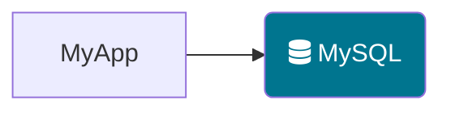
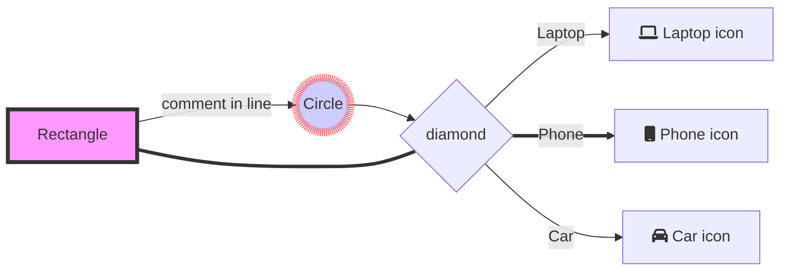
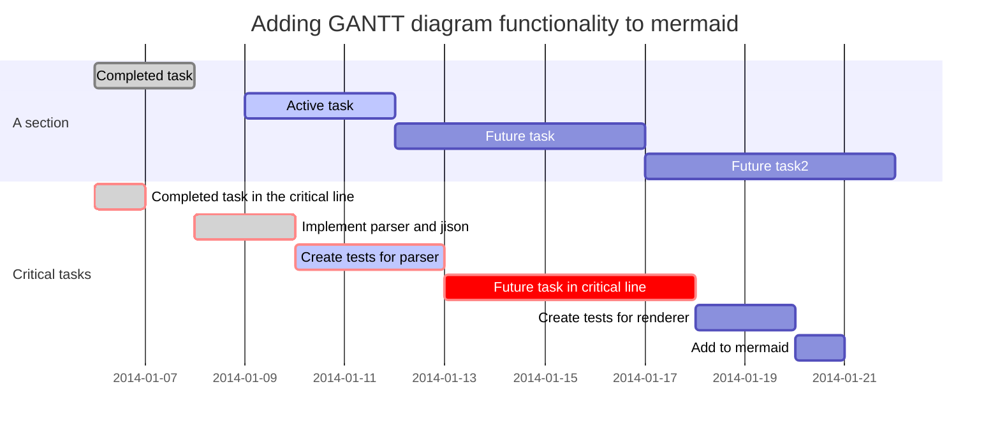

```flow
A=>operation: Data Preprocessing
(transformation, differencing)
B=>operation: Identify Model to be 
Tentatively Entertained

C=>operation: Estimate Parameters
D=>condition: Diagnosis Check
E=>operation: Use Model to Forecast

A->B->C->D
D(no)->B
D(yes)->E
```









