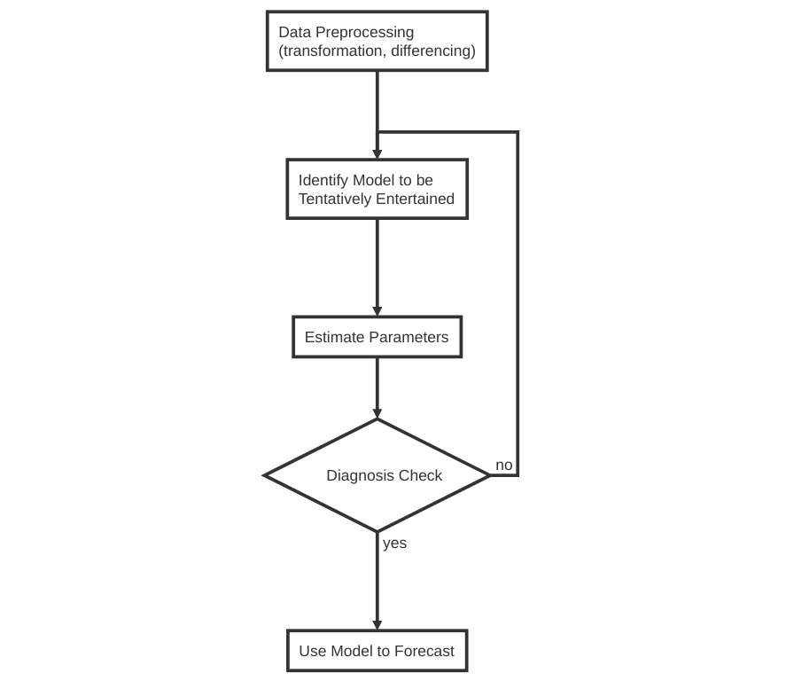
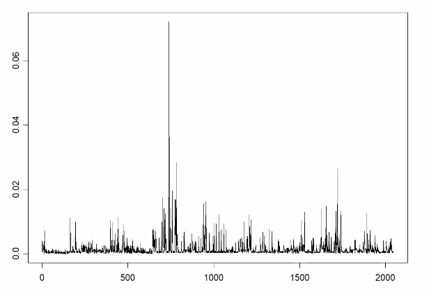
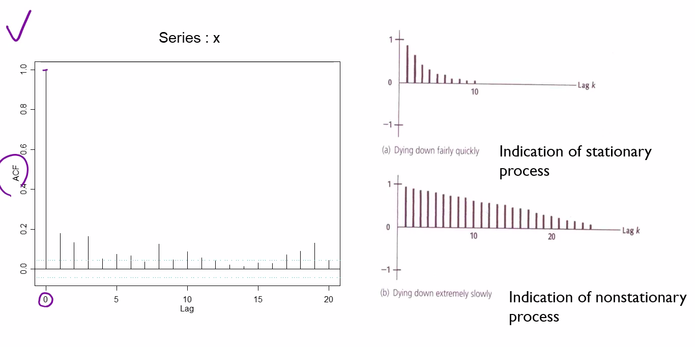
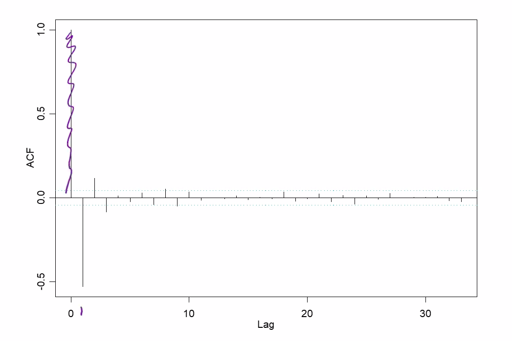
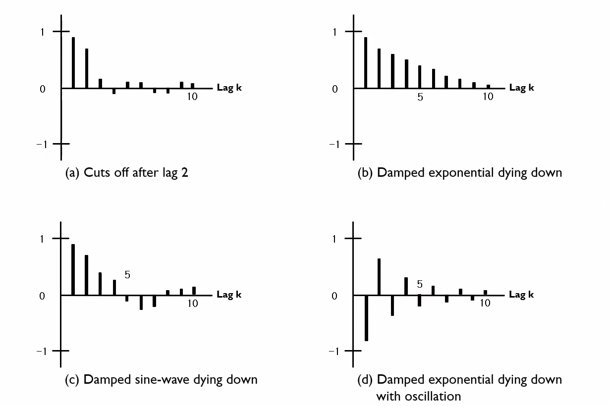
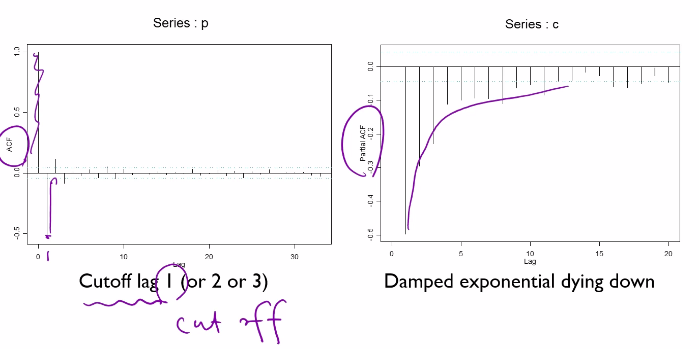
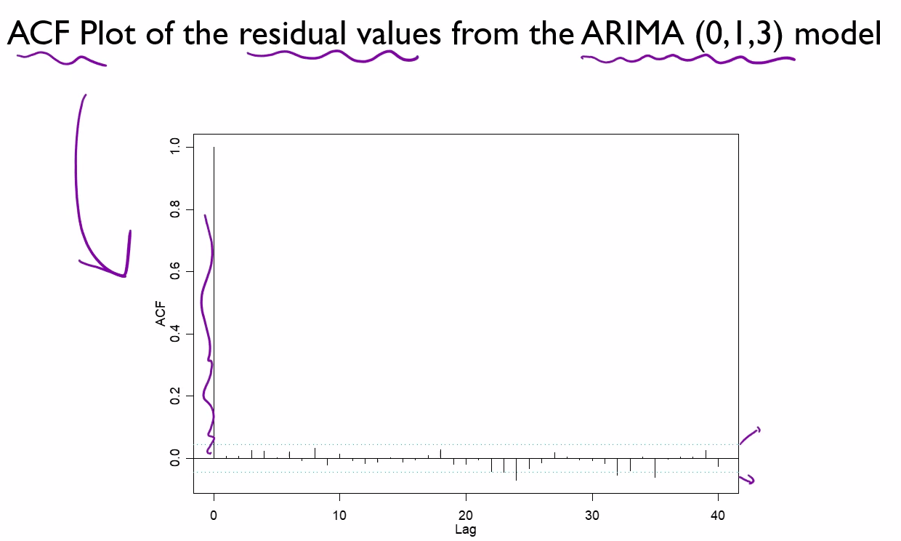

# ARIMA model

##### 참고자료 : 김성범교수 Youtube

##### Box-Jenkins ARIMA Procedure

## 1. data processing

#### ACF - check stationarity

- lag 0 일때는 항상 1(자기자신이기때문)
- nonstationary process 의 경우  ACF가 전반적으로 천천히 떨어지는 양상을 보임
- stationary process의 경우 급격히 떨어지거나 패턴이 없다

##### example

#### nonstationary -> stationary 바꿔 줘야함

- 차분

$$
Y_t = \Delta{X_t}=X_t - X_{t-1}
$$

- 1차 차분후 ACF

## 2. Identification ARIMA model

- **Graphical method**(주관적임) : making inferences from the patterns of the sample autocorrelation and partial autocorrelation functions of the series

- 시계열 데이터의 ACF, PACF 를 보고 패턴을 파악한다

|   Model   |                            ACF                             |                         Partial ACF                          |
| :-------: | :--------------------------------------------------------: | :----------------------------------------------------------: |
|   MA(q)   |       Cut off after lag q (q시차 이후 0으로 절단)       | Die out (지수적으로 감소,  소멸하는 sine함수 형태) |
|   AR(p)   | Die out (지수적으로 감소, 소멸하는 sine함수 형태) |       Cut off after lag p (p시차 이후 0으로 절단)       |
| ARMA(p,q) |          Die out (시차 (q-p)이후 부터 소멸)           |           Die out (시차 (q-p)이후 부터 소멸)            |

##### 각 상황 예시

##### - 아래 결과를 보고 q값으로 1 선정 해본다

- p,q를 시범적으로 결정

- 그후 그주변 값들을 계산해봄
- ex ARIMA(0,1,1)/ p,d,q/ ARIMA(0,1,2)/ ARIMA(0,1,3) \... 

- computing power가 좋기 때문에 p(1~20) d(1~2) q(1~20) 의 grid search를 통해 최적값선정

## 3. Determination of Model

- Determine the model that renders the minimum AIC value
- AIC : 정확도의 척도 ,평가지표 , 낮을 수록 좋음

## 4. Diagnosis - Performance Evaluation

- Once the model has been specified and the parameters estimated, the model should be checked for adequacy
- Use the model to forecast all of the known values of the data and investigate the residuals, and generate the ACF plot for the residuals[($\hat y-y$) 실제값과 예측값의 차이]

- Rule: The model is OK if more than two or three out of 40 fall outside the bound of if one falls far outside the bounds. - 몇개만 예측에서 벗어난것은 괜찮다
- => 최종모델로 결정

-> 경계값이내로 들어옴

# Seasonal ARIMA Model

- 기존 ARIMA 모델에 계절 변동을 반영
- 줄여서 SARIMA
- SARIMA 모형은 각 계절에 따른 독립적인 ARIMA모델이 합쳐져 있는 모형
- 기존 ARIMA(p,d,q) 모형에 계절성 주기를 나타내는 차수 s가 추가적으로 필요하기 때문에 ARIMA(p,d,q)(P,D,Q)s 로 표기한다.
- s의 값은 월별 계절성을 나타낼 때는 s=12가 되고 분기별 계절성을 나타낼 때는 s=4가 된다.