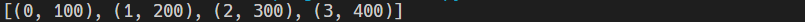

# itertools


## count

```python
import itertools
#count(start, step)
data = [100, 200, 300, 400]
daily_data = list(zip(itertools.count(), data))
print(daily_data)
```




## zip

- 기본 zip 은 가장 짧은 iterable value에 맞추어 실행된다
- zip_longest는 가장 긴것에 맞추어 실행되고 pair없는 것은 none처리됨

```python
data = [100, 200, 300, 400]
daily_data = list(zip(range(10), data))
daily_data2 = list(itertools.zip_longest(range(10), data))
print(daily_data)
print(daily_data2)
```


## cycle

```python
cycle = itertools.cycle(('on','off'))
print(next(cycle))
print(next(cycle))
print(next(cycle))
print(next(cycle))
print(next(cycle))
print(next(cycle))
```


## repeat

```python
squares = list(map(pow, range(10), itertools.repeat(2)))
squares2 = list(itertools.starmap(pow, [(0, 2), (1, 2), (2, 2)]))
print(squares)
print(squares2)
```


## Combination & Permutation & Product

```python
letters = ['a', 'b', 'c', 'd']
numbers = [0, 1, 2]
names = ['Corey', 'Nocole']

result1 = [i for i in itertools.combinations(numbers, 2)] #조합
result2 = [i for i in itertools.permutations(numbers, 2)] #순열
result3 = [i for i in itertools.product(numbers, repeat = 3)] #
result4 = [i for i in itertools.combinations_with_replacement(numbers, 3)] #중복허용 뽑기

print('combination\n', result, sep='', end='\n\n')
print('permutation\n', result2, sep='', end='\n\n')
print('product\n', result3, sep='', end='\n\n')
print('combination with replacement\n', result4, sep='', end='\n\n')
```


## product + $\alpha$

```python
from itertools import product
a = [(1,2),(3,4)]
l1=product(a, repeat=1)
l2=product(*a, repeat=1)
l3=product(a, repeat=2)
l4=product(*a, repeat=2)

for l in [l1,l2,l3,l4]:
    res = list(i for i in l)
    print('{}\n{}\n---'.format(len(res), res))
```


## chain

```python
letters = ['a', 'b', 'c', 'd']
numbers = [0, 1, 2]
names = ['Corey', 'Nocole']

combined = [ i for i in itertools.chain(letters, numbers, names)]
```


## islice

```python
result1 = [i for i in itertools.islice(range(10), 5)]
result2 = [i for i in itertools.islice(range(10), 1, 5)]
result3 = [i for i in itertools.islice(range(10), 1, 5, 2)]

print(result1)
print(result2)
print(result3)
```


- 파일을 이용한 예제

```python
# 위의 세줄만 읽기
with open('test.log', 'r') as f:
    header = itertools.islice(f, 3)
```


## compress & filterfalse

```python
def lt_2(n):
    if n < 2:
        return True
    
numbers = [0, 1, 2, 3]
selectors = [True, True, False, True]

result1 = [i for i in itertools.compress(numbers, selectors)]
result2 = [i for i in filter(lt_2, numbers)] #파이썬 filter함수
result3 = [i for i in itertools.filterfalse(lt_2, numbers)] #false만 반환한다

print(result1, result2, result3, sep='\n')
```


## dropwhile & takewhile

```python
numbers = [0, 1, 2, 3, 2, 1, 0]
result1 = [i for i in itertools.dropwhile(lt_2, numbers)] # 참이 처음 나올때까지 값 drop
result2 = [i for i in itertools.takewhile(lt_2, numbers)] # 거짓 처음 나올때까지 반환

print(result1, result2, sep='\n')
```


## accumulate

```python
import operator

numbers = [1, 2, 3, 2, 1, 0]
result1 = [i for i in itertools.accumulate(numbers)]
result2 = [i for i in itertools.accumulate(numbers, operator.mul)]
print(result1, result2, sep='\n')
```


## groupby

```python
def get_state(person):
    return person['state']

people = [
    {'name': 'John Doe', 'city': 'Gotham', 'state': 'NY'},
    {'name': 'Jane Doe', 'city': 'Kings Landing', 'state': 'NY'},
    {'name': 'Corey Schafer', 'city': 'Boulder', 'state': 'CO'},
    {'name': 'Al Einstein', 'city': 'Denver', 'state': 'CO'},
    {'name': 'John Henry','city': 'Hinton', 'state': 'WV'},
    {'name': 'Randy Moss', 'city': 'Rand', 'state': 'WV'},
    {'name': 'Nicole K', 'city': 'Asheville', 'state': 'NC'},
    {'name': 'Jim Doe', 'city': 'Charlotte', 'state': 'NC'},
    {'name': 'Jane Taylor', 'city': 'Faketown', 'state': 'NC'}
]

person_group = itertools.groupby(people, get_state)

for key, group in person_group:
    print(key, len(list(group)))
    # for person in group:
    #     print(person)
    # print()
```


## tee

```
copy1, copy2 = itertools.tee(person_group, 2)
```

복제시키는 것, 복사시킨후 기존것은 사용할수 없음